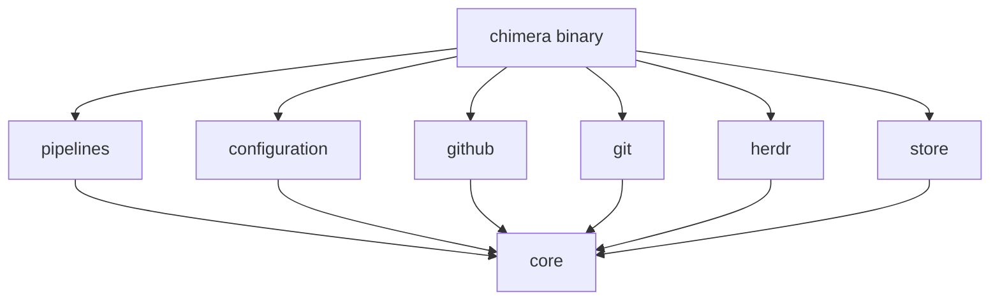

# Chimera architecture

This document maps the pipelines in [logical.md](logical.md), which derive from
[functional.md](functional.md), onto a Rust workspace organized as a modular
monolith: one binary, one process, several crates with enforced dependency
directions.

## Principles

- **Ports and adapters.** Pipelines depend on traits (ports) for GitHub, Git,
  Herdr, and storage. Adapter crates implement them. Only the binary knows
  about concrete adapters.
- **Pipelines are state machines.** Each pipeline instance has a serializable
  state. Every step reads the state, performs one external effect, and returns
  the next state, which is saved before continuing. Restart reloads the state
  and resumes the step.
- **One crate per reason to change.** Domain, configuration, orchestration, and
  each external system change for different reasons, so they live apart.

## Workspace layout

```text
chimera/
├── Cargo.toml              workspace + root binary package `chimera`
├── src/main.rs             composition root and CLI
└── crates/
    ├── core/               domain types and ports
    ├── configuration/      configuration pipeline
    ├── pipelines/          feature, ticket, implementation, PR review pipelines
    │                       and the shared services
    ├── github/             GitHub adapter
    ├── git/                Git adapter
    ├── herdr/              Herdr adapter
    └── store/              run state and history adapter
```

## Dependency rules



- `core` depends on no other Chimera crate.
- `pipelines` depends only on `core`. It never names an adapter.
- Adapters depend only on `core`, never on each other or on `pipelines`.
- Only the binary depends on everything and wires adapters into pipelines.

These rules are checked by the crate graph itself: a forbidden import fails to
compile because the dependency is not declared.

## Crates

### `core`

Domain types and ports. No I/O.

| Kind | Items |
| --- | --- |
| Identifiers | `RunId`, `IssueRef`, `BranchName`, `CommitId`, `WorkspaceId`, `PaneId`, `AgentId` |
| Domain | `Specification`, `Feature`, `Ticket`, `TicketPlan`, `WorkItem` (`Ticket` or `Findings`), `MergedOk` |
| Agents | `Role` (`Implementation`, `Review`, `Merge`), `AgentProfile`, `AgentConfiguration` (three profiles), `Limits` |
| Turns | `Assignment`, `TurnResult`, `Outcome` |
| Ports | `Forge`, `Repository`, `Terminal`, `RunStore` |

Ports, by the logical operations they serve:

| Port | Operations | Used by |
| --- | --- | --- |
| `Forge` | Read issue and sub-issues with blocked-by links; create draft PR; close issue; mark PR ready | Feature, Ticket, PR review |
| `Repository` | Resolve base branch; create feature branch; create and remove worktree; prune; read remote head | Feature, Implementation, PR review |
| `Terminal` | Create workspace; split pane; launch agent; send prompt; read status; read output; close workspace | Agent turn service, environments |
| `RunStore` | Save and load pipeline state; append history | All pipelines, Agent turn service |

`Outcome` covers the structured results from functional.md: implementation
ready, review approved, changes requested, merge ready for conflict review,
merge successful, and merge blocked. Each carries an explanation.

### `configuration`

The Configuration pipeline: configuration file to `AgentConfigurations`
(ticket set and final set), reset commands per provider, and `Limits` with the
defaults from logical.md. It parses YAML with serde and validates that every
role in both sets has a profile and a prompt template. Errors stop startup.

Provider-specific launch arguments (for example Codex flags) are built here,
so `herdr` receives a ready command line and stays provider-agnostic.

### `pipelines`

The four orchestration pipelines and the shared services. Generic over the
ports, or holding them as `Arc<dyn Port>`.

```text
pipelines/src/
├── lib.rs
├── feature.rs          Specification -> Feature
├── ticket.rs           Feature -> AllTicketsMerged
├── implementation.rs   (WorkItem, AgentConfiguration) -> MergedOk
├── pr_review.rs        Feature -> PrReady
├── environment.rs      provision and clean up worktree + workspace + agents
├── agent_turn.rs       prompt -> validated TurnResult
├── merge_lock.rs       FIFO lock per feature branch
└── policy.rs           global pause and run-wide budgets
```

Each pipeline has the same shape:

```rust
pub enum ImplementationState {
    Provisioning,
    Implementing { cycle: u32 },
    Reviewing { cycle: u32 },
    WaitingForMerge,
    Merging { attempt: u32 },
    ConflictReview { attempt: u32 },
    Verifying { attempt: u32 },
    CleaningUp { merged: CommitId },
    Done(MergedOk),
    Paused { reason: PauseReason, resume_at: Box<ImplementationState> },
}

impl ImplementationPipeline {
    pub async fn run(&mut self) -> Result<MergedOk, PipelineError> {
        loop {
            let next = self.step().await?;   // one external effect
            self.store.save(&self.id, &next).await?;
            if let ImplementationState::Done(ok) = next { return Ok(ok); }
            self.state = next;
        }
    }
}
```

Composition follows logical.md:

- `ticket` starts one `implementation` task per eligible ticket and closes the
  issue on each `MergedOk` before re-evaluating eligibility.
- `pr_review` runs `implementation` with `WorkItem::Findings` and the final
  configuration for each round of fixes.
- `merge_lock` is held from `Merging` until verified push and never released by
  a pause. Waiters are ordered by a persisted enqueue sequence, so FIFO order
  survives restart.
- `agent_turn` sends the prompt, polls `Terminal` status, parses the result,
  asks for corrections on invalid output, appends every turn to history, and
  clears the sender's context only after the receiver has started.
- `policy` holds the global pause flag and the agent recovery and GitHub retry
  budgets. Every step checks it before starting an agent, handoff, or merge.

### `github`

Implements `Forge` against the GitHub API. Sub-issues and blocked-by links are
read through GraphQL; the remaining operations use REST. Retries are not
handled here; the pipeline asks `policy` before retrying.

### `git`

Implements `Repository` by invoking the `git` CLI, which supports worktrees and
matches what agents use in their panes. It also reads the remote feature head so
the Implementation pipeline can verify a push and detect unexpected changes.

### `herdr`

Implements `Terminal` over Herdr's JSON protocol on its Unix socket. It maps
Herdr's lifecycle statuses to a small `TurnStatus` (running, finished, gone).
It knows nothing about roles, prompts, or results.

### `store`

Implements `RunStore` on the file system, under a run directory outside the
repository and its worktrees, so agents cannot read it:

```text
$XDG_STATE_HOME/chimera/runs/<run-id>/
├── run.json              run input, ticket plan, feature, configuration
├── pipelines/<id>.json   one state file per pipeline instance
├── merge-lock.json       queue order and current holder
└── history.md            every completed agent turn, append-only
```

State files are written atomically (write to a temporary file, then rename).
External effects are saved as intent before and outcome after, so restart can
tell a completed effect from an uncertain one.

## Binary

`src/main.rs` parses the CLI, builds the adapters, and runs the pipelines:

```text
chimera run --repo <path> --spec <issue> --config <file>
chimera resume <run-id>
```

`run` executes Configuration, Feature, Ticket, and PR review in sequence.
`resume` loads saved state, reconciles each pipeline's current step against
GitHub, Git, and Herdr, and continues. A paused run stays paused.

## Runtime and concurrency

- Tokio multi-threaded runtime. Each Implementation pipeline instance is one
  task in a `JoinSet` owned by the Ticket pipeline. There is no concurrency
  limit.
- The Herdr client is synchronous today. It runs on `spawn_blocking` or is
  ported to Tokio's `UnixStream`; the `Terminal` port is async either way.
- The merge lock is a fair FIFO async lock plus the persisted enqueue sequence.
- Status polling uses a fixed interval per agent turn. No inactivity timeout is
  added beyond Herdr's own statuses.

## Errors

- Each crate defines its own error type with `thiserror`.
- Adapters classify failures as *failed* (the effect did not happen) or
  *uncertain* (the response was lost). Pipelines retry failed effects with
  `policy` permission and reconcile uncertain ones before retrying.
- The binary reports errors with `anyhow` and exits non-zero only for startup
  errors; pauses are reported as run status, not as process failure.

## Testing

- `core` exposes in-memory fakes for every port behind a `testing` feature.
- Pipelines are tested against fakes: state transitions, review loops, merge
  lock ordering, pause behavior, and restart from every saved state.
- Adapters have integration tests against real Git repositories in temporary
  directories and, where available, a running Herdr; GitHub tests are opt-in.
