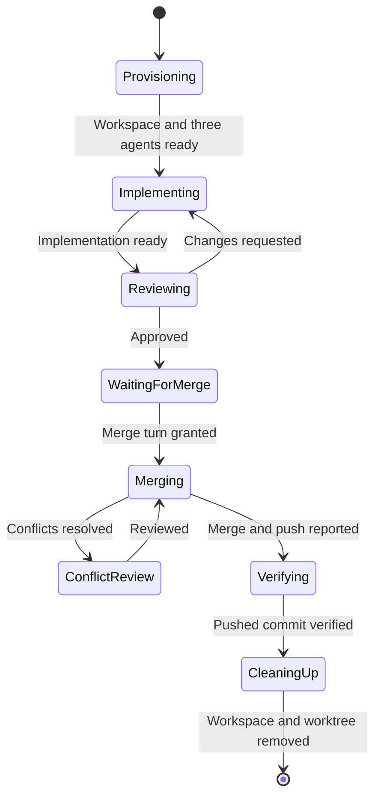
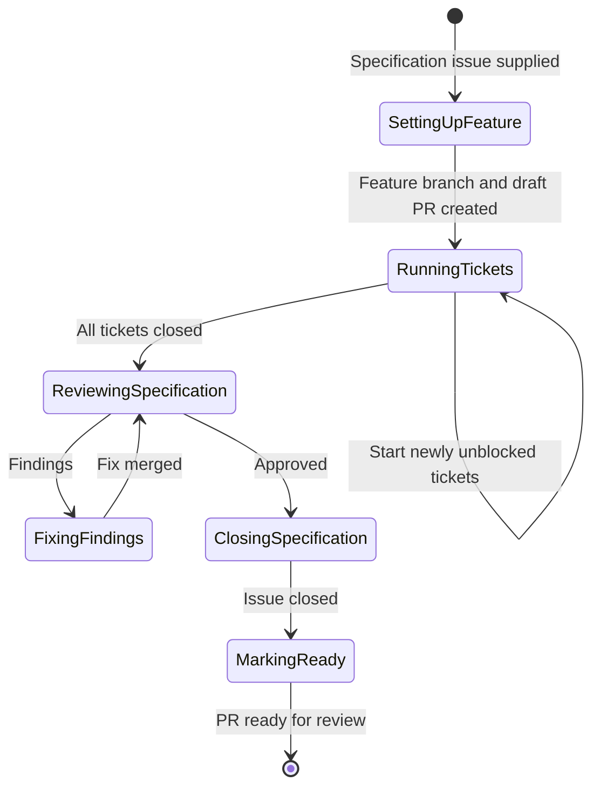

# Chimera functional overview

Chimera turns a GitHub specification issue into a pull request ready for review.
It coordinates AI coding agents running in Herdr workspaces: agents implement,
review, and merge each task, and Chimera decides what runs when.

## Inputs and output

A run takes a repository, a GitHub specification issue, and a configuration
file. Its output is a PR ready for review, with the specification and all its
sub-issues closed, temporary worktrees and workspaces removed, and a history of
every agent turn retained.

## Concepts

- A **specification** is a GitHub issue that describes one feature. It becomes
  one feature branch and one draft PR.
- A **ticket** is a sub-issue of the specification: a small, atomic task with
  specific acceptance criteria. Tickets may be blocked by other tickets using
  GitHub's "blocked by" relationships.
- An **agent triplet** is an implementation, a review, and a merge agent working
  in one Herdr workspace on one worktree.

## Configuration

Chimera reads a configuration file that defines two agent triplets: one for
tickets and one for final specification work. For each of the six roles it sets
the provider, model, settings, and prompt template. It also sets each provider's
context reset command (default `/clear`) and these limits:

| Limit | Default | Behavior when exhausted |
| --- | --- | --- |
| Implementation/review cycles per task | 100 | Pause that task; other tasks continue |
| Merge attempts per task, including conflict review and push failures | 100 | Pause that merge; other merges stay blocked |
| Final specification review/fix cycles | 100 | Pause final work; the PR stays in draft |
| Agent recovery | 5 | Pause the entire run |
| GitHub operation retries | 5 | Pause the entire run |

Invalid configuration prevents the run from starting. Test requirements, TDD,
review scope, and commands belong in prompt templates; Chimera does not encode a
test policy.

## Feature setup

Chimera creates a feature branch from `develop`, falling back to the repository's
default branch if `develop` does not exist, and opens a draft PR from the feature
branch to that base. Chimera owns the feature branch exclusively during the run;
an unexpected remote change pauses the entire run for intervention.

## Ticket scheduling

Chimera reads the specification's sub-issues and their blocking relationships.
This ticket set and its dependencies are fixed for the run. Sub-issues already
closed count as done.

Every open, unblocked ticket that is not running starts immediately; there is no
concurrency limit. When a ticket's merge is verified, Chimera closes its issue
and then starts any tickets that are now unblocked. When no ticket can start but
some remain blocked, the run waits. Ticket work is finished when every ticket is
closed.

## Task implementation

A task is a ticket, or a set of findings from the final specification review.
Each task gets its own worktree based on the feature branch and a Herdr workspace
in it, split into three panes with an agent triplet. All three agents start
immediately and wait for work.

The implementation agent receives its prompt and the task reference, and follows
test-driven development with tests aligned to the acceptance criteria. The review
agent assesses the whole worktree against the task, including whether changes
are out of scope. Requested changes go back to implementation until approved.

### Merging

Approved tasks wait for the merge turn, which is granted one task at a time in
first-in, first-out order. The merge agent rebases on the latest feature branch.
A clean rebase with passing tests is merged and pushed without another review.

If resolving conflicts requires changes, the review agent checks the whole
worktree against the task again. Its corrections go back to the merge agent, not
the implementation agent. The task keeps the merge turn throughout; other tasks
can keep implementing and reviewing meanwhile.

Chimera independently verifies the pushed commit, then releases the merge turn.
A failed push keeps the merge turn and blocks other merges. Tests must pass
before every merge.

After a verified merge, Chimera closes the workspace, removes the worktree, and
prunes worktree metadata. History is kept.

## Final specification review

When every ticket is closed, a review agent from the final triplet reviews the
whole feature branch against the specification. If it has findings, they become
a task that goes through implementation, review, and merging as above, using the
final triplet's configuration in a new workspace. After each fix is merged, the
full specification review repeats.

When the review approves, Chimera closes the specification issue, then marks the
PR ready for review, then removes the review environment.

## Agent turns and handoffs

Chimera sends an agent a prompt, follows its Herdr status until the turn
finishes, and reads its output. Each turn must end with a structured result:
implementation ready, review approved or changes requested, merge ready for
conflict review, or merge successful or blocked, with an explanation.

If the output has no valid result, Chimera asks the same agent to correct it,
keeping its context. Corrections count toward that task's limit.

Agents receive only what Chimera sends: role instructions, the issue reference,
and the latest relevant description from the previous agent. On a handoff, the
receiving agent must start successfully before the sending agent's context is
cleared with the provider's reset command. If the handoff fails, the sender keeps
its context. Each new assignment starts with fresh context.

Every completed turn, including corrections and turns without a handoff, is
appended to a Markdown history file. Agents cannot access this history.

## Pauses and failures

A paused task stops without affecting other tasks, except that a paused merge
keeps the merge turn. A global pause starts no new agents, handoffs, or merges;
agents already working may finish, and their results are saved for later.

A failed GitHub operation is retried on its own, without repeating work that
already succeeded; for example, closing an issue after its merge was verified.
Chimera relies on Herdr's agent statuses rather than its own inactivity timeout.
When an agent fails, Chimera checks whether it is still running and resumes its
existing conversation where possible.

## Persistence and restart

Chimera saves run progress durably. After a restart it reconnects to existing
agents, reconciles its saved progress with Herdr, GitHub, and Git, and continues
from the first step not yet confirmed, without repeating completed effects. A
run paused for intervention stays paused after restart. The ticket set is not
rediscovered.

## Outside the current scope

- Validating the dependency graph, including cycles and external blockers.
- Intervention commands, and whether resuming resets exhausted limits.
