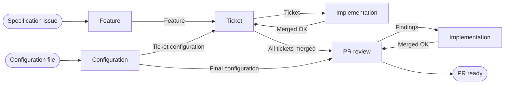

# Chimera logical overview

This design derives logical pipelines from the behavior in
[functional.md](functional.md), independently of the existing implementation.
A pipeline turns one input into one output. It does not imply a particular
language, process, module, API, or storage technology.

At the system boundary, Chimera accepts a repository, a specification issue, and
a configuration file. Its successful output is a PR ready for review, with the
specification and its sub-issues closed, temporary environments removed, and
history retained. An interrupted run instead exposes its saved progress and the
reason intervention is required.

## Domain

- A **specification** is a GitHub issue describing one feature. One
  specification maps to one feature branch and one draft PR.
- A **ticket** is a sub-issue of the specification: a small, atomic task with
  specific acceptance criteria. Tickets may block each other.
- A **work item** is what an implementation pipeline works on: a ticket, or a
  set of review findings against the specification.

## Pipelines

| Pipeline | Input | Output |
| --- | --- | --- |
| Configuration | Configuration file | Agent configurations |
| Feature | Specification issue | Feature (branch and draft PR) |
| Ticket | Feature | All tickets merged |
| Implementation | Work item and agent configuration | Merged OK |
| PR review | Feature with all tickets merged | PR ready |

A run composes them:

The Ticket and PR review pipelines both run the same Implementation pipeline;
they differ only in the work item and the agent configuration they pass.

### Configuration pipeline

**Input:** Configuration file (format not yet chosen).
**Output:** Agent configurations, or errors that prevent startup.

Produces two agent configurations, one for tickets and one for final
specification work. Each holds an implementation, review, and merge agent: its
provider, model, settings, and prompt template. It also resolves each provider's
context reset command (default `/clear`) and the attempt limits:

| Limit | Default | Owned by |
| --- | --- | --- |
| Implementation/review cycles | 100 | Implementation pipeline |
| Merge attempts, including conflict review and push failures | 100 | Implementation pipeline |
| Final specification review/fix cycles | 100 | PR review pipeline |
| Agent recovery | 5 | Run policy |
| GitHub operation retries | 5 | Run policy |

Test requirements, TDD, review scope, and commands belong in prompt templates.
Chimera does not encode a test policy.

### Feature pipeline

**Input:** Specification issue.
**Output:** Feature: specification reference, base branch, feature branch,
expected remote head, and draft PR.

1. Select `develop` as base, falling back to the repository's default branch.
2. Create the feature branch from the base.
3. Open a draft PR from the feature branch to the base.

Chimera owns the feature branch exclusively for the rest of the run.

### Ticket pipeline

**Input:** Feature.
**Output:** All tickets merged.

1. Read the specification's sub-issues and their "blocked by" relationships.
   This ticket plan is fixed for the run. Tickets already closed count as done.
2. Start an Implementation pipeline, with the ticket configuration, for every
   open, unblocked ticket that is not running. There is no concurrency limit.
3. On merged OK, close the ticket's issue, then repeat step 2 for tickets that
   are now unblocked.
4. Finish when every ticket is closed. No runnable tickets while some remain
   blocked means waiting, not completion.

A paused Implementation pipeline does not stop the others.

### Implementation pipeline

**Input:** Work item and agent configuration.
**Output:** Merged OK: verified pushed commit on the feature branch.

```mermaid
stateDiagram-v2
    [*] --> Provisioning
    Provisioning --> Implementing: Worktree, workspace, three agents ready
    Implementing --> Reviewing: Implementation ready
    Reviewing --> Implementing: Changes requested
    Reviewing --> WaitingForMerge: Approved
    WaitingForMerge --> Merging: Merge lock acquired
    Merging --> ConflictReview: Conflicts resolved
    ConflictReview --> Merging: Changes requested
    ConflictReview --> Merging: Approved
    Merging --> Verifying: Merge and push reported
    Verifying --> CleaningUp: Pushed commit verified; lock released
    CleaningUp --> [*]: Workspace and worktree removed
```

- **Provisioning:** create a worktree from the feature branch and a Herdr
  workspace in it, split it into three panes, and launch the implementation,
  review, and merge agents. They wait until assigned work.
- **Implementing / Reviewing:** the implementation agent receives its prompt and
  the work item reference. The review agent assesses the whole worktree against
  the work item, including scope. Changes requested go back to implementation.
- **Merging:** waits for the merge lock (FIFO). The merge agent rebases on the
  latest feature branch. A clean rebase with passing tests merges and pushes
  without another review. Conflict changes go to the review agent; its
  corrections go back to the merge agent, which keeps the lock.
- **Verifying:** Chimera independently checks the pushed commit and updates the
  expected remote head. A failed push keeps the lock and retries the merge.
- **Cleaning up:** close the workspace, remove the worktree, prune metadata.
  History is kept.

Exhausting the implementation/review limit pauses this pipeline. Exhausting the
merge limit pauses it while it keeps the lock, which blocks other merges.

### PR review pipeline

**Input:** Feature with all tickets merged.
**Output:** PR ready.

1. Provision a review agent with the final configuration on the feature branch.
2. Review the whole implementation against the specification.
3. On findings, run an Implementation pipeline with the findings as work item
   and the final configuration. On merged OK, go back to step 2.
4. On approval, close the specification issue, then mark the PR ready.
5. Clean up the review environment.

Exhausting the review/fix limit pauses this pipeline and leaves the PR in draft.

## Shared services

These are called from inside pipeline steps. They are not pipelines.

### Agent turn

**Input:** Agent, prompt. **Output:** Validated structured result.

Sends the prompt, polls Herdr until the turn finishes, and reads the output.
Results are: implementation ready, review approved or changes requested, merge
ready for conflict review, and merge successful or blocked, each with an
explanation. Invalid output is sent back to the same agent for correction, with
context retained; corrections count toward the caller's limit.

On a handoff, the receiving agent must start successfully before the sending
agent's context is cleared with the provider's reset command. Each new
assignment starts with fresh context. Prompts contain only role instructions,
the issue reference, and the latest relevant description from the previous
agent. Every completed turn, including corrections, is appended to the run's
Markdown history, which agents cannot access.

### Merge lock

A single FIFO lock per feature branch, held by at most one Implementation
pipeline from merge start until verified push. Pausing never releases it.

### Run state

Each pipeline instance durably saves its current step, counters, resource and
conversation references, and pending results. External effects are recorded as
intent before and outcome after, so an uncertain effect is checked rather than
repeated.

After a restart, Chimera reloads each instance, reconnects to its agents,
reconciles Herdr, GitHub, and Git against its current step, and continues from
the first unconfirmed step. The ticket plan is not rediscovered. A paused run
stays paused.

### Run policy

Holds the global pause flag and the budgets that pause the whole run: agent
recovery, GitHub retries, and unexpected remote changes to the feature branch.
A global pause starts no new agents, handoffs, or merges; active turns may finish
and their results are saved. GitHub failures retry only the failed operation.

## Outside the current scope

Dependency graph validation, including cycles and external blockers;
intervention commands; and whether resuming resets exhausted counters.
